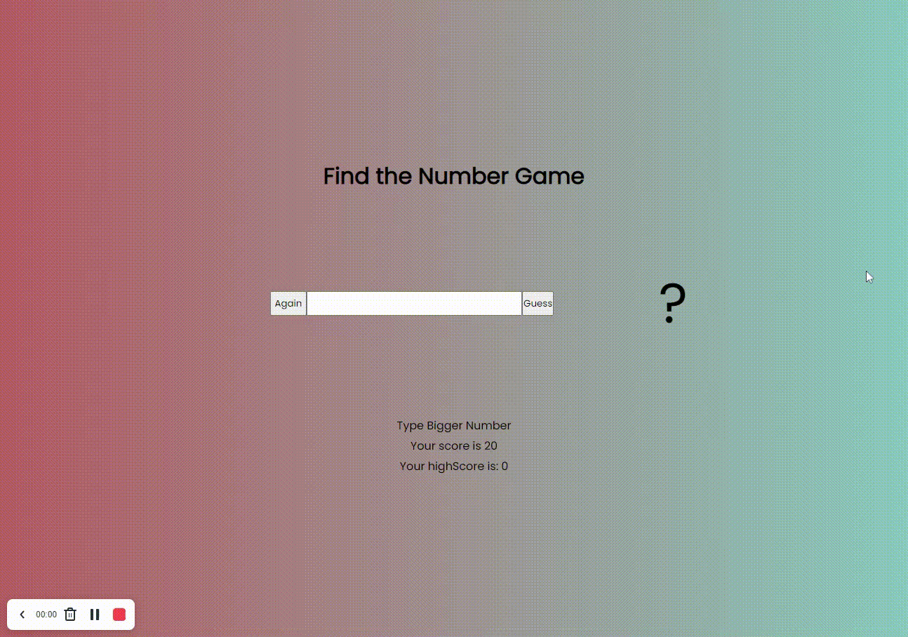

# Find-the-Number

## Welcome! 👋

Thanks to visit my Github! In this project, i used flexbox. This project is created with HTML, CSS and JavaScript. Here is the link for this project (https://omer-cicek.github.io/Find-the-Number/)

**To do this project, i used basic HTML, CSS and JavaScript.**

## The challenge

Users should be able to:

- View the optimal layout for the site depending on their device's screen size
- Can play game 
- Memory user's best score

## Got feedback for me?

Feedbacks are always improve my technical knowledge, so feel free to give me a feedback through my LinkedIn account (https://www.linkedin.com/in/omercicek97/) 🙌

**That Is What I Did!** 🚀
